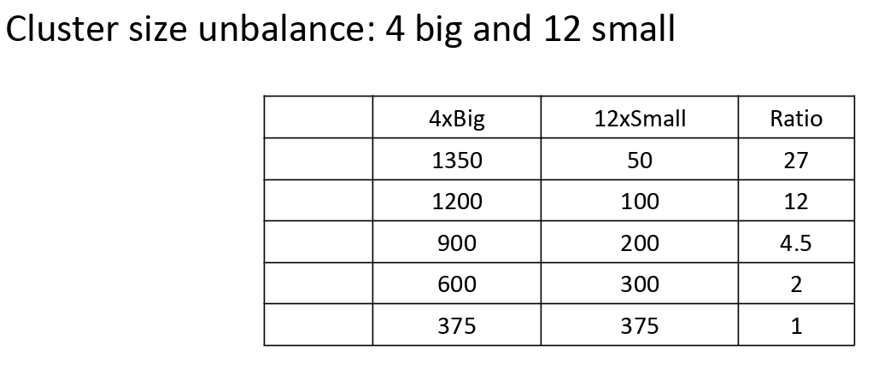
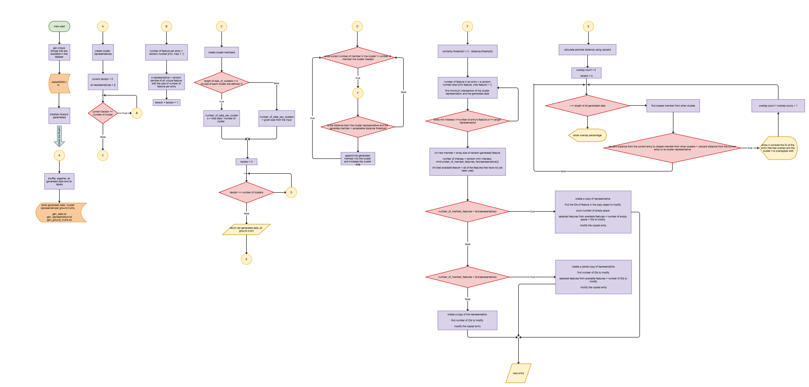

# String Dataset Generator
Python3 scripts for string dataset generator for clustering purpose. 

*It is important to note thatThis implementation relies heavily on Jaccard's similarity method.*

## How to run
### Create folder data
```sh
mkdir data
```
make sure you have your data file in there.

#### Example of content on data file
Let's say you have a data file which contains a list of patients with icd-10 diseases.

The data file will look like the following

```
L01 K11 R44 X09 F00
F00 R21
M12 B20 L40 K50
.
.
.
W08 Q90 P00
```

### Execute the following command
```sh
# this will execute the example from main 
$ cd src/
$ python3 main.py
```

## Using it as library
To use this program as a library you can simple import `artificial_set_data_generator` in to your python module the call the following function `artificial_set_data_generator.generate`.

### The function takes the following parameters
* **data_size** : (int) an integer number specifies number of total number of data that will be generated
* **size_of_clusters** : (numpy arry) specifies size for each cluster. If empty array is passed then the size of all cluster will be the same.
                Note that len of array should equal to number_of_cluster and sum of this array should equal to data_size
* **number_of_cluster** : (int) an integer number specifies number of cluster to create
* **dimension** : (int) an integer number specifies total number of features that will be generate in the data set
* **distance_threshold** : (float) a number specifies the maximum distance away from the cluster representative according to Jaccard's method
* **size_of_set** : (tuple(int,int)) a tuple of intergers specifies the minimum and maximum feature that each data has to contain
* **all_features** : (string[]) an array of string containing all possible features of the dataset
* **gt_representative** : (string[][]) if empty the program will randomly generate the cluster representatives, else program uses the provides values as cluster representatives

## Supplying your own ground truth representatives
As mentioned above, you can do so by given them through `gt_representative`

If you run the code from our `main.py` you can store your ground truth representatives in `data` directory and change the path in `GT_REPRESENTATIVE_FILE_PATH` accordingly.

Make sure that your stored representatives are store in the same format as the original input (take a look at the example above).

## Creating imbalance clusters
From the configuration section, there is an option that you can provide different sizes for each cluster (array with integers instead of empty for `size_of_clusters`)

The library provides some APIs to help generate those values in the pattern that have been found common.

Those APIs located in `size.py` under `imbalance` directory

* **random_cluster_sizes** : 
    * arguments: (int) data size, (int) number of cluster
    * output: (int[]) integers array with len of number of cluster, each element will be a random number that in total will sum to the amount of data size.

* **build_specific_sizes** :
    * arguments (int) data size, ((int, int)) a tuple of 2 integers specify number of big and small clusters accordingly, (int) ratio of big and small cluster member
    * output: (int[]) integers array with len of number of cluster with specified number of big and small clusters. The value of each element will be the number of cluster according to the given ratio.

    *example with 6000 data size*
    


## Output
From the `main.py` example, the output will be written the 3 separate files in out folder.

* gen_data{}N_{}K_{}overlap.txt
* gt_representative{}N_{}K_{}overlap.txt
* gt_labels{}N_{}K_{}overlap.txt

*note: {} before N will be formatted with number of generated **data** you specified*

*note2: {} before K will be formatted with number of generated **cluster** you specified*

*note3: {} before overlap stand for the percentage of **data overlap** that program generated*

## Program flow chart

